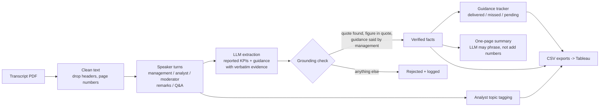

# EarningsLens: grounded AI research assistant for Indian bank earnings calls

EarningsLens reads earnings-call transcripts from India's largest banks, extracts reported KPIs and management guidance with an LLM, and **rejects any figure it cannot verify word for word in the transcript**. It then checks whether management delivered what it guided, tags what analysts worried about, drafts a one-page summary per call, and exports tidy CSVs for a Tableau dashboard.

Coverage: ICICI Bank, HDFC Bank, Axis Bank, Kotak Mahindra Bank and State Bank of India, Q4 FY25 to Q1 FY27 (30 calls).

> **Related project:** the grounding and extraction approach here was adapted
> for SEC filings in [StreetLens](https://github.com/preekshitsaklani/StreetLens),
> a US financials research platform covering JPMorgan Chase, Goldman Sachs,
> BlackRock and State Street.

## Why it exists

An analyst covering five banks reads about 20 transcripts a quarter, mainly to answer three questions: what did each bank report, what did management promise, and did it deliver last time? LLMs can do the reading, but in research a single invented number is worse than no answer. EarningsLens therefore treats every LLM output as a claim that has to be checked against the source before anyone sees it.

## How it works



**The grounding check** (`grounding.py`) accepts an extracted item only if all three hold:
1. Its evidence quote is found in the transcript (exact, or a fuzzy match of 92+ for PDF artefacts).
2. The extracted number, or a phrase such as "mid-teens", sits inside that quote. Phrases map to bands through a fixed, auditable table (mid-teens = 14% to 16%).
3. For guidance, the quote comes from a management speaker, not from an analyst's question.

Summaries follow the same rule: the LLM may only rephrase verified facts, and any paragraph containing a number that is not in the facts is discarded in favour of a template.

**Guidance tracker** (`tracker.py`): each verified guidance statement is checked against the bank's reported figure in later quarters within its horizon, with a tolerance by metric family (1.0 pt for growth, 10 bps for margins and asset quality). "Range-bound" margins count as delivered if the margin moves less than 10 bps.

**One LLM client, any provider** (`llm.py`): Gemini, Ollama (local, free) and Groq all expose OpenAI-compatible endpoints, so switching provider is a `.env` change. Responses are cached by prompt hash, so re-runs are free and reproducible.

## Quickstart (no API key needed)

```bash
pip install -r requirements.txt
PYTHONPATH=src python -m earningslens demo     # synthetic bank, recorded LLM responses
python -m pytest -q                             # 8 offline tests
```

The demo runs a synthetic "Example Bank" (two quarters) through the full pipeline. Its recorded LLM responses include four planted errors: an invented number, an unknown metric, a fabricated quote and an analyst's remark posing as guidance. All four are rejected; the tests assert this.

## Running it on the real banks

1. **LLM access.** Either create a free API key in Google AI Studio (Gemini), or install Ollama and pull a model. Copy `.env.example` to `.env` and fill it in. Never commit `.env`.
2. **Transcripts.** Download each call's transcript PDF from the bank's investor-relations page (listed banks also file transcripts with BSE and NSE). Save them in `data/raw/`, for example `data/raw/ICICIBANK_Q1FY27.pdf`.
3. **Manifest.** In `data/manifest.csv`, fill `local_file` (e.g. `data/raw/ICICIBANK_Q1FY27.pdf`), `call_date` and `source_url` for each row. Rows with an empty `local_file` are skipped.
4. **Run.**
   ```bash
   PYTHONPATH=src python -m earningslens run --extractor llm      # main run
   PYTHONPATH=src python -m earningslens run --extractor regex    # baseline for comparison
   ```
5. **Label a gold set.** Hand-check about 100 reported figures (roughly 10 per call across 10 calls) from the transcripts into `data/gold.csv`, using `data/gold_template.csv` as the format.
6. **Evaluate.** `PYTHONPATH=src python -m earningslens evaluate` prints precision, recall, F1 and grounding rate for the LLM and the regex baseline.
7. **Dashboard.** Follow `dashboard/TABLEAU_GUIDE.md` and publish to Tableau Public.

## Outputs (`output/<extractor>/`)

| File | Contents |
| --- | --- |
| `csv/kpis.csv` | Every extracted reported figure with evidence quote and grounding status |
| `csv/guidance.csv` | Every extracted guidance statement, normalised to a band or direction |
| `csv/guidance_tracker.csv` | Each verified guidance item: checked in which quarter, observed value, delivered / missed / pending |
| `csv/guidance_scorecard.csv` | Delivery rate per bank |
| `csv/analyst_topics.csv` | Each analyst question with firm and topic |
| `csv/runs.csv` | Timing, LLM calls, grounded and rejected counts per call |
| `summaries/*.md` | One-page summary per bank-quarter |

## Measuring results honestly

Report only what you measured:
- **Extraction accuracy:** precision and recall from `evaluate` on your hand-labelled gold set, LLM vs regex baseline.
- **Grounding:** the share of LLM items rejected (`n_rejected` in `runs.csv`), with examples of what was caught.
- **Time saved:** time yourself writing three call summaries by hand, then compare with `seconds_total` in `runs.csv` plus your review time.

## Limitations

- Speaker detection relies on the "Name: text" layout used by Indian bank transcripts; unusual layouts need a regex tweak in `segment.py`.
- Guidance horizons such as "medium term" default to the next four quarters.
- The keyword topic tagger is a fallback; the LLM tagger is used whenever an LLM is configured.
- Reported figures are taken from management's own words on the call, not from the audited results filing.

## Project structure

```
src/earningslens/
  config.py     banks, metric taxonomy, tolerances, quarter helpers
  ingest.py     PDF/TXT loading, header and page-number cleanup, manifest
  segment.py    speaker turns, roles (management / analyst / moderator), sections
  schema.py     typed records; invalid LLM output is dropped and counted
  llm.py        OpenAI-compatible client (Gemini / Ollama / Groq), retries, cache
  extract.py    LLM extractor (main) and regex extractor (baseline)
  grounding.py  verification of every figure against the transcript
  tracker.py    guidance vs delivery, per-bank scorecard
  topics.py     analyst question topics (LLM with keyword fallback)
  summarize.py  one-page summaries from verified facts only
  pipeline.py   end-to-end run and aggregation
  export.py     tidy CSV schemas for Tableau
  evaluate.py   precision / recall / F1 against a gold set
  cli.py        demo | run | evaluate
tests/          offline tests on a synthetic bank with recorded LLM responses
dashboard/      Tableau Public build guide
```
